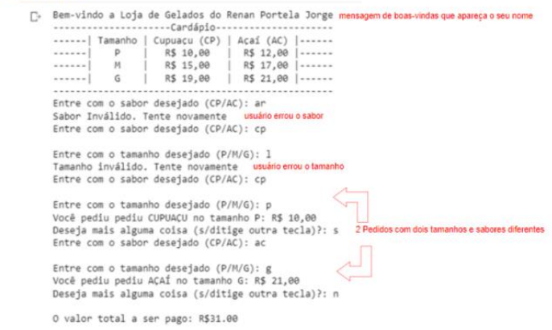

# QUESTÃO 1 - Desenvolvimento de Interface para Retirada de Produto

## Enunciado
Você e sua equipe de programadores foram contratados para desenvolver um app de vendas para uma loja que vende **Açaí** e **Cupuaçu**. Sua tarefa é desenvolver a interface do cliente para retirada do produto. A loja possui a seguinte tabela de preços:

| Tamanho | Cupuaçu (CP) | Açaí (AC) |
|---------|-------------|-----------|
| **P**   | R$ 9.00    | R$ 11.00  |
| **M**   | R$ 14.00   | R$ 16.00  |
| **G**   | R$ 18.00   | R$ 20.00  |

---

## Requisitos do Programa

### **Exigências de Código**
1. Implementar um `print` com mensagem de boas-vindas exibindo seu nome.  
2. Implementar um `input` do sabor (CP/AC) e exibir `"Sabor inválido. Tente novamente"` caso o usuário insira um valor diferente de **CP** ou **AC**.  
3. Implementar um `input` do tamanho (P/M/G) e exibir `"Tamanho inválido. Tente novamente"` caso o usuário insira um valor diferente de **P, M ou G**.  
4. Implementar um `if/else if` para todas as combinações de sabor e tamanho conforme a tabela de preços.  
5. Implementar um acumulador para somar os valores dos pedidos.  
6. Implementar um `input` perguntando: `"Deseja pedir mais alguma coisa?"`. Se **sim**, repetir o processo desde o item **B**. Se **não**, encerrar o programa e exibir o total acumulado.  
7. Implementar as estruturas **while, break e continue** no código.  
8. Inserir comentários relevantes explicando o código.  

---

### **Exigências de Saída no Console**
1. Exibir a mensagem de boas-vindas com seu nome.  
2. Exibir um caso onde o usuário erra o sabor, mostrando `"Sabor inválido. Tente novamente"`.  
3. Exibir um caso onde o usuário erra o tamanho, mostrando `"Tamanho inválido. Tente novamente"`.  
4. Exibir um pedido contendo dois sabores diferentes e tamanhos diferentes.  

---

## Exemplo de saída

